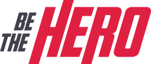
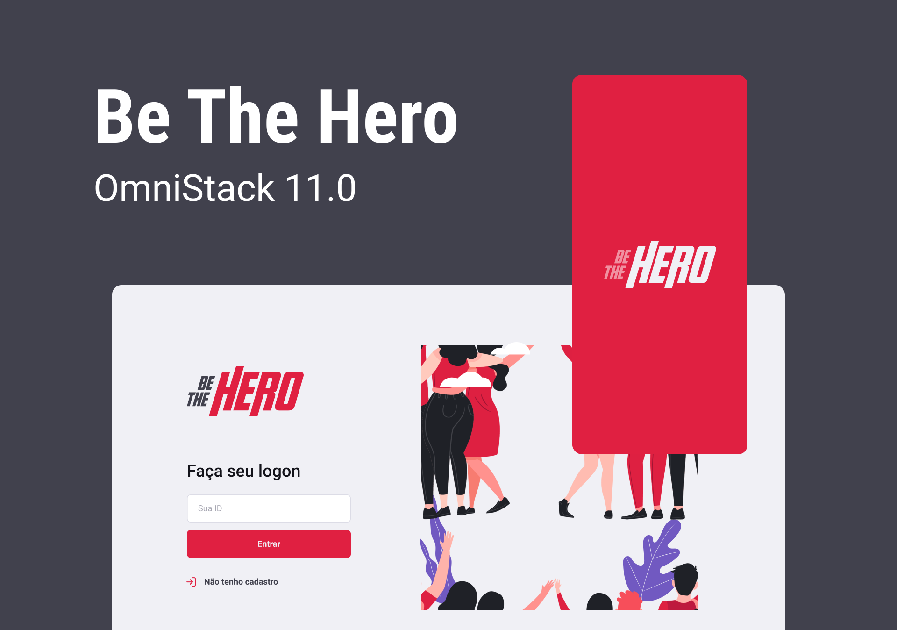

Projeto "Be the Hero" desenvolvido durante a Semana Omnistack 11.0 com a mentoria de [Diego Fernandes](https://github.com/diego3g) da [Rocketseat](https://rocketseat.com.br/). O BeTheHero é um projeto que visa conectar pessoas que desejam fazer contribuições monetárias a ONG's (Organizações não governamentais) que precisam de ajuda. / Project "Be the Hero" developed during Omnistack Week 11.0 with the mentorship of [Diego Fernandes](https://github.com/diego3g) from [Rocketseat](https://rocketseat.com.br/). BeTheHero is a project that aims to connect people who want to make monetary contributions to NGOs (Non-Governmental Organizations) that need help.

⚙ **Tecnologias Utilizadas / Used technologies** 

- [Node.js](https://nodejs.org/en/)
- [Expo](https://expo.io/)
- [Express](https://expressjs.com/)
- [Axios](https://axios-http.com/)
- [Eslint](https://eslint.org/)
- [Jest](https://jestjs.io/)
- [React](https://reactjs.org/)
- [React Native](https://reactnative.dev/)

----------------------------------------------------------------------------------------------------------------------------------------------------------------------------------

🧑🏾‍💻 **Autor / Author**

**Matheus Gomes de Souza**

LinkedIn: https://www.linkedin.com/in/matheus-gomes-de-souza/  
E-mail: matheusg_souza@outlook.com
